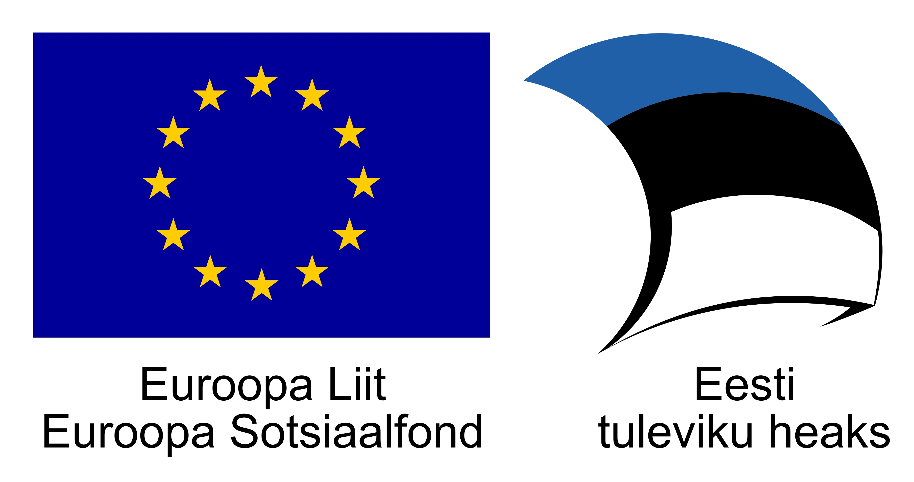

H5P Musical Dictations Library
==========

Library for creating musical dictations. See https://otsakool.edu.ee/digisolf/askdictation/1voice
 as an example.

Creator of the exercise has to upload an audio file with a short melody  and define the notation via Lilypond notation language or graphical user interface (enter the notes). 

This module supports only one voice dictations.

Depends on: https://github.com/tarmoj/vexflow-react-components (pulled as submodule).

Built on React, uses Lilypond as its notation language + graphical UI, VexFlow for rendering notation.

Developed  at Georg Ots Tallinna Music School, now Tallinn College of Music and Ballet for project "Digitaalse muusikateooria ja solfedžo õppevara täiustamine ja arendamine" with the support of European Social Fund (Euroopa Sotsiaalfond).

## License

The MIT License -  see LICENSE enclosed in this folder for details.

## Author

Tarmo Johannes tarmo.johannes@muba.edu.ee

